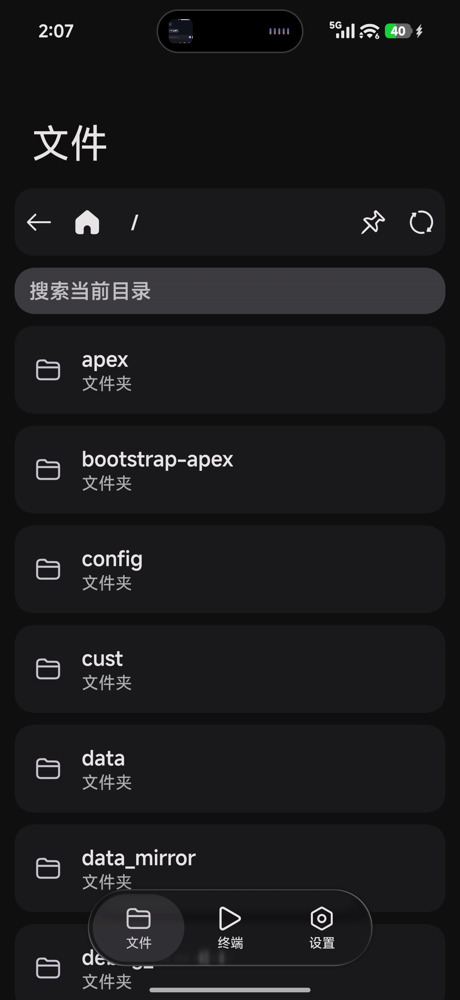
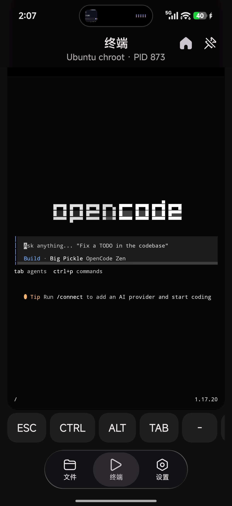
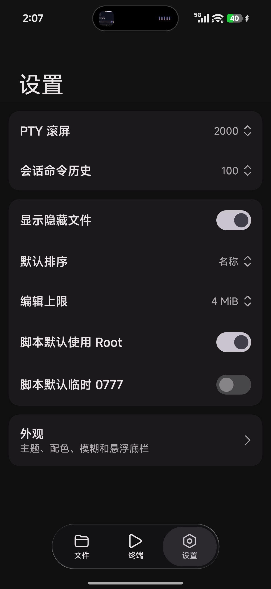

<div align="center">

# HyperShell

**为 HyperOS 打造的本地终端与 Root 文件浏览器**

基于 Jetpack Compose、Miuix 与 Termux Terminal 构建，在一个简洁的界面中完成终端操作、Root 文件访问与 Linux 环境切换。

[](https://developer.android.com/)
[](https://kotlinlang.org/)
[](https://github.com/compose-miuix-ui/miuix)
[](https://github.com/Github1145142882/HyperShell/releases/latest)

### [下载最新版本](https://github.com/Github1145142882/HyperShell/releases/latest)

</div>

## 界面预览

<table>
  <tr>
    <td align="center"><strong>Root 文件浏览</strong></td>
    <td align="center"><strong>终端与 Linux 环境</strong></td>
    <td align="center"><strong>Miuix 设置</strong></td>
  </tr>
  <tr>
    <td></td>
    <td></td>
    <td></td>
  </tr>
</table>

## 主要功能

- **Termux 兼容终端**：交互式 PTY、ANSI/256 色、快捷按键、触摸滚动、双指缩放与软键盘输入。
- **Linux 环境**：支持应用终端以及 Root chroot / proot 兼容模式切换；实际可用能力取决于设备内核、Root 实现与已安装环境。
- **Root 文件浏览**：目录浏览、搜索、排序、书签、文本查看与编辑，并可处理 Shell 脚本和 ZIP 内容。
- **脚本执行**：支持普通或 Root 执行；临时权限变更会记录原权限并在任务结束后恢复。
- **HyperOS 风格界面**：使用 Miuix 组件、Monet 动态色、深浅模式、悬浮液态玻璃底栏与可选 HDR 反馈。
- **终端外观**：字体、字号、背景色、背景图片、压暗与模糊均可调整。
- **数据最小化**：不保存命令历史和终端输出，不集成统计或追踪；是否保留会话由用户明确控制。

## 使用要求

- Android 8.0（API 26）或更高版本。
- Root 文件访问和 chroot 需要 Magisk、KernelSU 等 Root 方案。
- KernelSU 用户应在管理器中预先授予包名 `io.github.hypershell`；HyperShell 只验证 Root 是否可用，不控制管理器授权。
- 软件包可用性由当前仓库索引和目标架构决定。遇到仓库或镜像错误时，请先查看对应 Release 说明与 Issues。

> [!IMPORTANT]
> 请只在自己拥有或获准管理的设备上使用。Root 写入、执行脚本与修改权限均可能造成数据丢失或系统无法启动，请在确认目标路径和内容后操作。

## 构建

需要 JDK 17、Android SDK 及 NDK。Debian 13 ARM64 rootfs 由固定 Docker Official Image OCI digest 生成；仓库不会提交生成的 bootstrap、Debian rootfs、APK 和 `.deb` 仓库。重建终端环境前请阅读 [`termux-build/README.md`](termux-build/README.md)。

```bash
./gradlew :app:assembleDebug
```

```bash
./termux-build/scripts/prepare-debian-asset.sh
```

Windows：

```powershell
.\gradlew.bat :app:assembleDebug
```

应用包名固定为 `io.github.hypershell`。Termux 软件包必须针对该包名对应的绝对 prefix 重编，不能直接混用为 `com.termux` 构建的二进制包。

## 软件源

`Build HyperShell repository` 工作流负责构建软件包、签名 APT 元数据并发布到 `gh-pages`。应用内置公钥，源地址为：

```text
https://raw.githubusercontent.com/Github1145142882/HyperShell/gh-pages/
```

公钥指纹记录在 [`termux-build/repository-key.fingerprint`](termux-build/repository-key.fingerprint)，私钥仅存放在 GitHub Actions Secret `HYPERSHELL_REPOSITORY_PRIVATE_KEY` 中。

## 安全边界

HyperShell 不会隐藏应用或进程、擦除系统审计日志、伪装包特征，也不会绕过 Magisk / KernelSU 的授权。项目所说的“少留痕迹”仅指应用自身不持久化命令历史、终端输出或无必要的后台任务。

## 致谢

- [Miuix](https://github.com/compose-miuix-ui/miuix) — HyperOS 风格 Compose 组件
- [KernelSU-Style-UI-Kit](https://github.com/chenaizhang/KernelSU-Style-UI-Kit) — 界面与动效设计参考
- [Termux](https://github.com/termux/termux-app) 与 [termux-packages](https://github.com/termux/termux-packages) — 终端组件与软件包构建基础
- Android、Kotlin、Jetpack Compose 及相关开源项目贡献者

## 反馈

提交问题时请附上 Android 版本、Root 方案、应用版本、复现步骤和已脱敏日志： [Issues](https://github.com/Github1145142882/HyperShell/issues)
